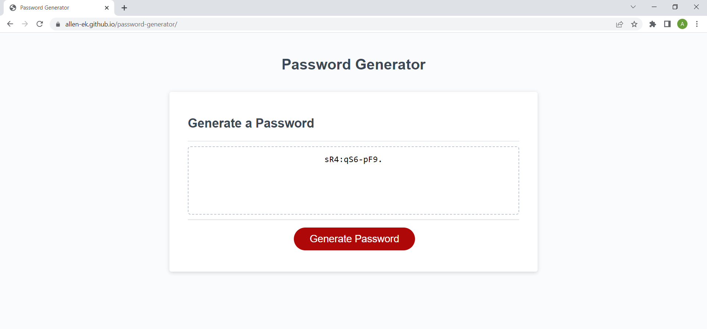

# password-generator Project

# Authors
Allen Klein
- [Link to Password Generator Site](https://allen-ek.github.io/password-generator/)
- [Link to Github Repository](https://github.com/allen-ek/password-generator)

## Why?
I wanted to be able to create a dynamic password generator webpage allowing for users to input different choices prompted by the webpage. That would allow for the user to determine password size and wether or not to contain uppercase,lowercase, numbers and special characters. 
## What I learned
I learned various javascript methods such as prompt,Math,and alert methods that allowed for dynamic functionality to an HTML webpage with CSS styling. I also learned how to create,modify and iteriate through arrays in javascript. I also learned how to interact with the user using a webpage and allow for interaction with the user in order to generate a password with user selection criterias.

## Technologies Used
HTML
JavaScript
CSS
Github

## Screenshot of project webpage

